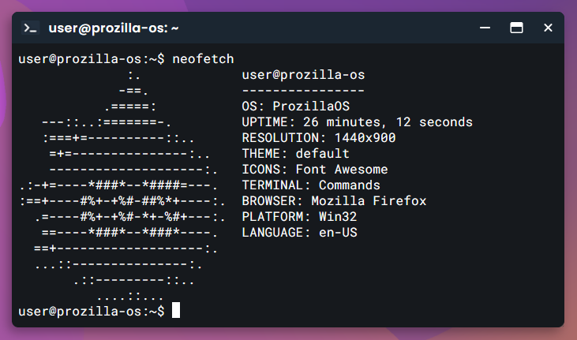

[← Back](../README.md)

#  Terminal ("Commands")

A command line tool.

## Screenshot



## Commands

See [features/applications/terminal/commands.js](../../../../src/features/applications/terminal/commands.js) for a list of commands. You can edit this file to add/remove/edit commands.

## Examples

### Touch command

```js
// features/applications/terminal/commands/touch.js

export const touch = new Command("touch")
	.setRequireArgs(true)
	.setManual({
		purpose: "Change file timestamps",
		usage: "touch [OPTION]... FILE...",
		description: "Update the access and modification times of each FILE to the current time.\n\n"
			+ "A FILE argument that does not exist is created empty."
	})
	.setExecute(function(args, { currentDirectory }) {
		if (args[0] === "girls\\" && args[1] === "boo**")
			return `${this.name}: Cannot touch 'girls boo**': Permission denied`;
	
		const [name, extension] = args[0].split(".");
	
		if (currentDirectory.findFile(name, extension))
			return { blank: true };
	
		currentDirectory.createFile(name, extension);
		return { blank: true };
	});
```